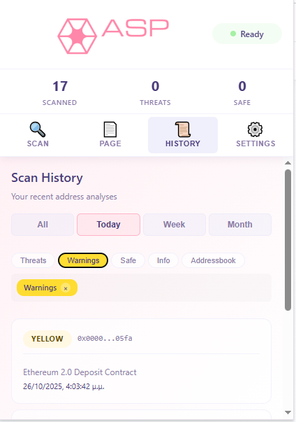
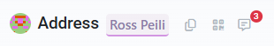

# Web3 ASP: Agentic Security Protocol

> Privacy-first Web3 security analysis powered by on-device AI and real-time threat intelligence

**Version**: 0.3.9 | **Status**: Published on Chrome Web Store | **Last Updated**: October 30, 2025

Web3 ASP (H3 Aspis) is a Chrome extension that provides real-time security analysis of smart contracts and wallet addresses as you browse the Web3. Using GoPlus Security API for threat detection and Google Chrome's built-in Gemini Nano AI for intelligent summaries, Web3 ASP is completely local-first with no cloud dependencies - protecting your privacy while keeping you safe.

<p align="center">
  
</p>

<div align="center">
  <a href="https://chromewebstore.google.com/detail/kdnidamilegaknppnfglehffbpbpdjgo" style="display:inline-block; text-align:left;">
    
  </a>
</div>

---

## 🛡️ Features

### Core Features (v0.3.9)
- **Real-Time Address Detection**: Automatically scans web pages for Ethereum addresses
- **Visual Security Indicators**: Color-coded highlighting (Green = Safe, Yellow = Warning, Red = Dangerous, Blue = Info, Purple = Addressbook)
- **GoPlus Security API**: Real-time threat intelligence for honeypots, scams, and rug pulls
- **On-Device AI Summaries**: Uses Gemini Nano to explain security findings in plain English
- **Manual Scan Tool**: Analyze any address on-demand with detailed reports
- **Sanctions Database**: 36 verified sanctioned addresses on Ethereum Mainnet (OFAC, FBI, Israeli NBCTF), thousands more across other chains
- **My Addressbook**: Save trusted addresses with custom tags
- **Scan History**: Browse all analyzed addresses with time-based filters (all, today, week, month)
- **Filter Pills**: Quick filtering by threat level (threats, warnings, safe, info, addressbook)
- **Multi-Address Support**: Handle multiple addresses on a single page

### Privacy-First Design
- ✅ AI summaries run **entirely on your device** (Gemini Nano)
- ✅ Sanctions database is 100% local (no external calls)
- ✅ Only address sent to GoPlus API for threat intelligence
- ✅ Addressbook and history saved **locally only** (no cloud, no accounts)
- ✅ Export/import via JSON files for backup
- ✅ You control retention policies (delete after 1 week to 1 year, or never)

### Security Architecture
- **Tier 1**: Local sanctions database - 36 verified addresses on Ethereum Mainnet (instant)
- **Tier 2**: GoPlus API - Behavioral threat detection (< 1 second)
- **Tier 3**: Gemini Nano AI - Explains findings in plain English (< 2 seconds)
- **Total**: < 3 seconds for complete analysis ⚡

### Free & Open
- ✅ All features are **free and publicly available**
- ✅ No accounts, no logins, no cloud services
- ✅ No tier gating or paywalls - everything works out of the box

---

## 📦 Installation

### Prerequisites
- Chrome browser (version 127+, Canary/Dev channel recommended for AI)
- **No API keys required!** Works out of the box with free public RPCs
- **No account needed!** Everything runs locally

### ⚡ Quick Start (Zero Config!)

You have two ways to install the extension.

**1. From the Chrome Web Store (Recommended)**

Click the badge below to install directly from the official Chrome Web Store:

[](https://chromewebstore.google.com/detail/kdnidamilegaknppnfglehffbpbpdjgo)

---

**2. Manual Installation (Developer Mode)**

If you prefer to install it manually (e.g., for development):

1. **Clone or Download** this repository

2. **Copy config file**
   ```bash
   cp config.example.js config.js
   ```
   **That's it!** The extension works with all defaults.

3. **Load Extension in Chrome**
   - Open `chrome://extensions/`
   - Enable "Developer mode" (top right)
   - Click "Load unpacked"
   - Select the `Web3-ASP` folder
   - Pin the extension to your toolbar

4. **Enable Chrome AI** (Optional but Recommended)
   - Navigate to `chrome://flags/#optimization-guide-on-device-model`
   - Set to "Enabled BypassPerfRequirement"
   - Navigate to `chrome://flags/#prompt-api-for-gemini-nano`
   - Set to "Enabled"
   - Restart Chrome

**You're done!** The extension now works with:
- ✅ Free public RPCs (no keys needed)
- ✅ GoPlus Security API (free, no key needed)
- ✅ Local sanctions database (36 addresses on Ethereum Mainnet)
- ✅ Chrome Gemini Nano AI (on-device)
- ✅ Local-only storage (no cloud, no accounts)

📖 **For detailed setup**: See [QUICK_SETUP.md](QUICK_SETUP.md)  
🔧 **For configuration options**: See [ENV_TEMPLATE.md](ENV_TEMPLATE.md)

### 🚀 Enhanced Setup (Optional)

Want more features? Add API keys for better performance:

**Option 1: Blockchain Explorer APIs** (Free)
- Get keys from [Etherscan](https://etherscan.io/apis), [Basescan](https://basescan.org/apis), [Polygonscan](https://polygonscan.com/apis)
- Add to `config.js` under `explorers`
- Benefits: Higher rate limits, contract source code

**Option 2: Private RPC Endpoints**
- Use [Alchemy](https://www.alchemy.com/), [Infura](https://infura.io/), or [QuickNode](https://www.quicknode.com/)
- Update `config.js` under `rpc`
- Benefits: Better reliability, no throttling

---

## 🚀 Usage

### Automatic Scanning
1. Visit any web page (e.g., Etherscan, Twitter, Telegram, Uniswap)
2. Web3 ASP automatically detects and highlights addresses
3. Hover over highlighted addresses for quick risk info
4. Click a highlighted address to see full analysis

<p align="center">
  
</p>

### Manual Scanning
1. Click the Web3 ASP icon in your toolbar
2. Go to the "Scan" tab
3. Paste any Ethereum/Base/Polygon address
4. Click "Analyze" to see detailed security report

### Viewing History
1. Click the Web3 ASP icon in your toolbar
2. Go to the "History" tab
3. Use time filters (all, today, week, month) to browse past scans
4. Use filter pills (threats, warnings, safe, info) to filter by status
5. Click any entry to see full analysis details

<p align="left">
  
</p>

### Understanding Risk Colors
- 🟢 **Green**: Safe - Verified contract or established wallet
- 🔵 **Blue**: Info - Standard wallet or informational
- 🟡 **Yellow**: Warning - Suspicious activity or medium risk
- 🔴 **Red**: Danger - Known scam, honeypot, or sanctioned entity
- 🟣 **Purple**: Addressbook - Your saved trusted address with custom tag

<p align="left">
  
</p>

---

## ⚙️ Configuration

### 🎯 Default Configuration (No Changes Needed!)

Web3 ASP works out of the box with:

```javascript
rpc: {
  ethereum: "https://cloudflare-eth.com",        // Free public RPC
  base: "https://mainnet.base.org",              // Free public RPC
  polygon: "https://polygon-rpc.com"             // Free public RPC
}

features: {
  enableSanctionsCheck: true,   // ✅ Local database
  enableGoPlus: true,            // ✅ Free API, no key needed
  enableOnDeviceAI: true,        // ✅ Chrome Gemini Nano
  enableHistory: true,           // ✅ Local history storage
  demoMode: true                 // ✅ All features unlocked
}
```

**Perfect for**: Personal use, and professional offline and online use.

### 🚀 Custom RPC Endpoints (Optional)

For production or heavy usage, use private RPCs:

```javascript
rpc: {
  ethereum: "https://eth-mainnet.g.alchemy.com/v2/YOUR_KEY",
  base: "https://base-mainnet.g.alchemy.com/v2/YOUR_KEY",
  polygon: "https://polygon-mainnet.g.alchemy.com/v2/YOUR_KEY"
}
```

**Recommended Providers:**
- [Alchemy](https://www.alchemy.com/) - Free tier: 300M compute units/month
- [Infura](https://infura.io/) - Free tier: 100k requests/day
- [QuickNode](https://www.quicknode.com/) - Free tier available

**Benefits**: Better reliability, higher rate limits, no throttling

### 🔍 Blockchain Explorer APIs (Optional)

For enhanced contract verification:

```javascript
explorers: {
  etherscan: "YOUR_ETHERSCAN_API_KEY",
  basescan: "YOUR_BASESCAN_API_KEY",
  polygonscan: "YOUR_POLYGONSCAN_API_KEY"
}
```

Get free API keys:
- [Etherscan](https://etherscan.io/apis) - 5 requests/second
- [Basescan](https://basescan.org/apis) - 5 requests/second
- [Polygonscan](https://polygonscan.com/apis) - 5 requests/second

**Benefits**: Contract source code access, higher rate limits

### 🔒 GoPlus Security API

**No configuration needed!** GoPlus is free and requires no API key.

```javascript
security: {
  goplus: {
    baseUrl: "https://api.gopluslabs.io/api/v1",
    enabled: true,
    timeout: 10000  // 10 seconds
  }
}
```

**Features**: Honeypot detection, scam analysis, token security audits  
**Documentation**: https://docs.gopluslabs.io/

### 📚 Configuration Reference

For complete configuration options, see:
- **[ENV_TEMPLATE.md](ENV_TEMPLATE.md)** - Environment variable reference
- **[QUICK_SETUP.md](QUICK_SETUP.md)** - Step-by-step setup guide
- **`config.example.js`** - Annotated configuration template

---

## 📊 Architecture

### Component Overview

```
Web3-ASP/
├── manifest.json              # Extension configuration
├── background.js              # Service worker (analysis orchestrator)
├── content.js                 # Page scanner & highlighter
├── popup.html/js/css          # Dashboard UI
├── utils/
│   ├── web3-utils.js          # Blockchain helpers
│   ├── analyzer.js            # AI prompt engineering
│   ├── addressbook-handler.js # Local contact management
│   ├── audit-trail-handler.js # Local history management
│   └── goplus-security.js     # Token security API
└── data/
    ├── sanctioned-wallets.js  # 36 sanctioned addresses (hardcoded)
    └── test-addresses.js      # 15 test addresses (hardcoded)
```

### Data Flow

```
Page Load → Content Script Scans DOM
    ↓
Detects 0x Addresses
    ↓
Sends to Background Script
    ↓
Background Checks Sanctions List (Offline)
    ↓
Queries Blockchain RPC (eth_getCode)
    ↓
Sends to Gemini Nano (On-Device AI)
    ↓
Returns Analysis Result
    ↓
Content Script Highlights Address
```

---

## 🧪 Development

### Project Structure
```
.
├── background.js              # Main service worker
├── content.js                 # Injected into web pages
├── popup.html                 # Dashboard HTML
├── popup.js                   # Dashboard logic
├── popup.css                  # Dashboard styles (lilac theme)
├── styles.css                 # Content script styles
├── manifest.json              # Extension manifest
├── config.example.js          # Configuration template
├── utils/                     # Utility modules
├── data/                      # Hardcoded datasets
└── icons/                     # Extension icons
```

### Adding New Features

1. **New Analysis Rules**: Edit `utils/analyzer.js`
2. **New UI Components**: Edit `popup.html` and `popup.css`
3. **New Datasets**: Add to `data/` and update import script
4. **New Blockchains**: Update `utils/web3-utils.js` and `config.js`

### Testing

```bash
# Test on different sites
- Etherscan.io (contract verification)
- Uniswap.org (DeFi protocols)
- OpenSea.io (NFT addresses)
- Random scam sites (test red alerts)

# Test scenarios
- Manual scan
- Page auto-scan
- Address highlighting
- Tooltip display
- History logging (if Firebase enabled)
```

---

## 🛠️ Troubleshooting

### Extension doesn't load
- Check that you're in Developer mode
- Verify manifest.json has no syntax errors
- Check background script console for errors

### No addresses detected
- Ensure content script is injecting (check page console)
- Verify site is not blocking content scripts
- Try reloading the page

### AI analysis not working
- Confirm Chrome AI flags are enabled
- Check Chrome version (127+ required)
- Verify Gemini Nano is downloaded
- Check background script console for AI errors

### Icons not showing
- Add icon files to `/icons/` directory
- Ensure filenames match manifest.json
- Reload extension

---

## 🔒 Security & Privacy

### What Web3 ASP Does:
- ✅ Analyzes addresses **on your device**
- ✅ Stores all data **locally only**
- ✅ Only sends addresses to GoPlus API for threat intelligence

### What Web3 ASP Does NOT Do:
- ❌ Track your browsing
- ❌ Require accounts or logins
- ❌ Use cloud storage or sync
- ❌ Collect personal information
- ❌ Use cookies or third-party trackers

### Data Storage:
- **Local Only**: Everything stored in `chrome.storage.local`
- **Export/Import**: Backup via JSON files
- **No Cloud**: No external storage or sync

---

## 📝 License

MIT License - See LICENSE file for details

---

## 🤝 Contributing

Contributions welcome! Please:
1. Fork the repository
2. Create a feature branch
3. Make your changes
4. Test thoroughly
5. Submit a pull request

---

## 📞 Support

- **GitHub**: [github.com/arpahls/web3-asp](https://github.com/arpahls/web3-asp)
- **Issues**: [GitHub Issues](https://github.com/arpahls/web3-asp/issues)
- **Documentation**: See comprehensive guides in repo

---

## 🎯 Roadmap

### v0.4.0 (Next Release)
- [ ] Multi-chain support expansion (Arbitrum, Optimism, Avalanche, BSC)
- [ ] Contract source code vulnerability scanning
- [ ] Transaction simulation preview
- [ ] Enhanced filter options and search

### v0.5.0
- [ ] NFT metadata analysis and fake detection
- [ ] Token approval checker
- [ ] Phishing domain detection
- [ ] Browser-wide security warnings

### v1.0.0 (Production Release)
- [ ] Community reporting system
- [ ] Advanced AI threat prediction
- [ ] Public API for dApp integration
- [ ] Enterprise features and compliance tools

---

## 🙏 Acknowledgments

- Built with [Chrome Built-in AI (Gemini Nano)](https://developer.chrome.com/docs/ai/built-in)
- Powered by [ARPA Hellenic Logical Systems](https://arpa.systems)
- Inspired by the Web3 security community

---

**Made with 💜 by the ARPA Team**

*Protecting the Web3 ecosystem, one address at a time.*

🔗 **GitHub**: [github.com/arpahls/web3-asp](https://github.com/arpahls/web3-asp)

---

## 📝 Version History

| Version | Date | Highlights |
|---------|------|------------|
| **0.3.9** | Oct 30, 2025 | Chrome Web Store compliance, removed cloud services |
| **0.3.8** | Oct 26, 2025 | Filter pills, enhanced history, UI improvements |
| **0.3.7** | Oct 25, 2025 | Fixed addressbook display with auto-scan |
| **0.3.6** | Oct 25, 2025 | Page/History tabs working, address highlighting fixed |
| **0.3.5** | Oct 25, 2025 | Addressbook button fixes, tag preservation |
| **0.3.4** | Oct 25, 2025 | Analysis flow improvements, fallback fixes |
| **0.3.3** | Oct 24, 2025 | Test addresses with real sanctions data |
| **0.3.2** | Oct 24, 2025 | Documentation cleanup, finalized security strategy |
| **0.3.1** | Oct 24, 2025 | Sanctions database rebuild (36 addresses) |
| **0.3.0** | Oct 24, 2025 | Addressbook & audit trail UI complete |
| **0.2.0** | Oct 24, 2025 | Multi-address support, sequential analysis |
| **0.1.0** | Oct 24, 2025 | Initial release with GoPlus & AI |


**See `UPDATE_NOTES.md` for complete changelog**


